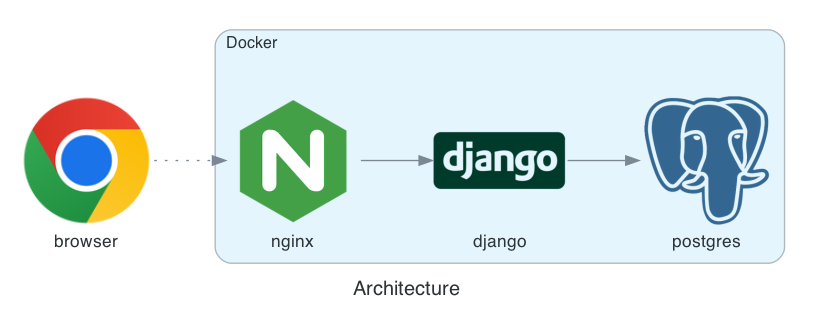
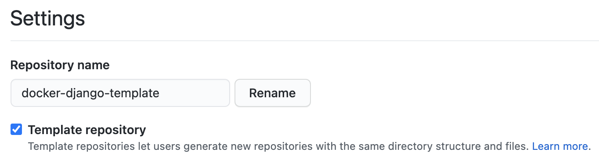
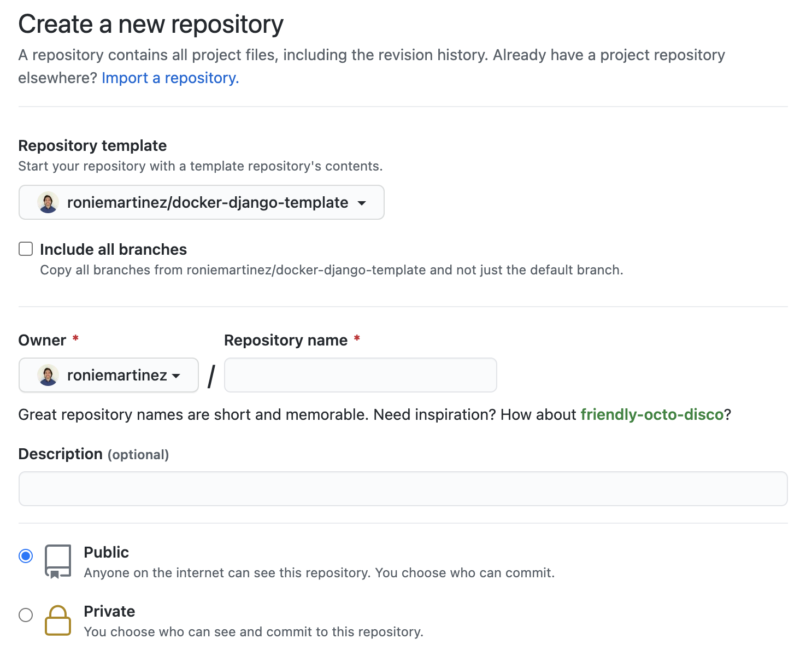
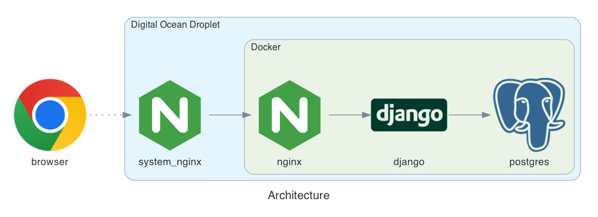

# Docker+Django Template

Template repository for a Docker+Django project

## What is in this template
- Scalable Django web app with login/registration and initial Bootstrap 4 template
- Nginx for load balancing traffic to the Django web apps when scaled
- PostgreSQL database

## Architecture



## Requirements

- Python 3.10 (optional, development should be done in the provided Docker environment)
- Docker Desktop (or Docker Compose)

## Demo

You can check this template in action using the URL [https://ddt.ron.sh/](https://ddt.ron.sh/)

## Creating a project from Docker+Django Template

1. Fork this project.
2. Go to settings and convert your fork to a Template Repository, if not yet checked.



3. Create a new project and specify a Repository template to use.



4. Happy coding!

## Build and run

Note: update the environment variables in `env` folder before running the following commands:

```shell
cd <project-folder>
docker-compose build
docker-compose up  # or "docker-compose up -d" to run in detached mode
```
Go to [http://localhost:8081](http://localhost:8081)

## Installation on a DigitalOcean Droplet and nginx (Optional)



If you don't have a DigitalOcean account yet, create one using my referral [link](https://m.do.co/c/5b9c0bd05e4e).

1. Create a Domain and add an `A record` pointing to your Droplet.
2. Inside your Droplet, create an SSL certificate:

```shell
certbot --nginx -d <domain>
```

3. Edit the nginx configuration (usually /etc/nginx/sites-available/default) and update the `location /` block just below the domain created by certbot (look for `server_name <domain>; # managed by Certbot`):
   
```
	location / {
            proxy_pass http://127.0.0.1:8081$request_uri;
            proxy_set_header X-Forwarded-For $proxy_add_x_forwarded_for;
            proxy_set_header Host $http_host;
            proxy_set_header X-Forwarded-Proto $scheme;
            proxy_redirect off;
	}
```

4. Reload nginx:

```shell
service nginx reload
```

## Scaling

To scale up, add --scale web=N parameter. For example:

```shell
docker-compose up --scale web=3
```

## Add translations

```shell
poetry run python manage.py makemessages -l <language_code>
# edit and translate locale/<language_code>/LC_MESSAGES/django.po
```

## Development

Use the `Makefile` included for running different development tasks:

1. `make install` - installs the packages needed for development.
2. `make build` - build application.
3. `make start` - start application.
4. `make format` - runs `autoflake`, `isort` and `black` for fixing coding style.
5. `make lint` - runs `autoflake`, `isort`, `black`, `flake8` and `mypy` checks.
6. `make test` - run unit tests.
7. `make migrations` - generate migration scripts, if applicable.
8. `make migrate` - run migrations, if applicable.
9. `make superuser` - create superuser.
10. `make messages` - update messages.
11. `make compilemessages` - compile messages.
12. `make dumpdata` - backup data.
13. `make loaddata` - load data from backup.

## Author

[Ronie Martinez](mailto:ronmarti18@gmail.com)
